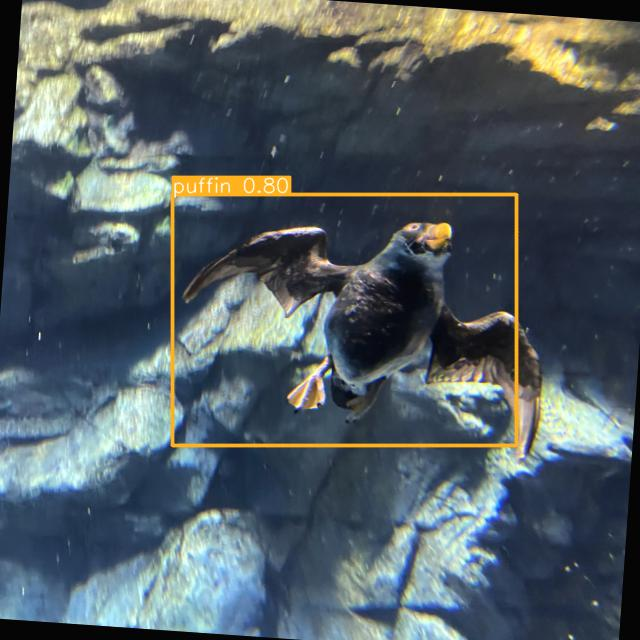
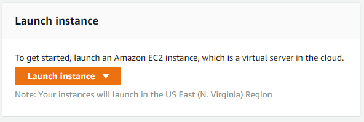
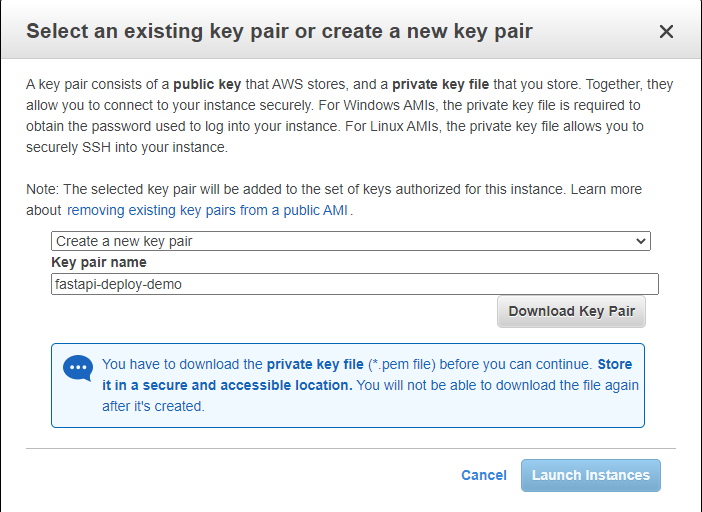
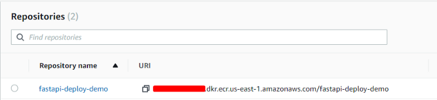

# Detectron2 deploy for aquarium dataset 


## Table of Contents

- [About](#about)
- [Getting Started](#getting_started)
- [Deployment](#deployment)

## About <a name = "about"></a>

Obtain object value out of image using Detectron2 .and return image and json result
trained on fish, jellyfish, penguins, sharks, puffins, stingrays, and starfish

## Getting Started <a name = "getting_started"></a>

[APP_LINK](http://ec2-100-25-181-236.compute-1.amazonaws.com:80/docs)

[deployment](#deployment) for notes on how to deploy the project on a live system.


## Deployment <a name = "deployment"></a>

 Deploying to AWS EC2

Create EC2 Instance
For the sake of demonstration, I will do everything from my AWS root account, but it’s not recommended, so make sure that you always create a separate user, and give the necessary permissions to accomplish the tasks.

Navigate to EC2 service, and click Launch Instance





```bash
$ chmod 400 fastapi-deploy-demo.pem # Substitute with your key

# Same directory where .pem key is located
ssh -i "fastapi-deploy-demo.pem" ec2-user@<your-details-here>.compute-1.amazonaws.com

```

```bash 
sudo apt update
sudo apt upgrade

# we need to install some necessary packages before we are ready to install Docker script. You can do this with the help of a single command:
sudo apt-get install curl apt-transport-https ca-certificates software-properties-common

# First, we add the GPG key, by entering the following command in the command line:
curl -fsSL https://download.docker.com/linux/ubuntu/gpg | sudo apt-key add -

# Next, we add the repository:

sudo add-apt-repository "deb [arch=amd64] https://download.docker.com/linux/ubuntu $(lsb_release -cs) stable"

sudo apt update

apt-cache policy docker-ce

#correct output 

########################################################################################
# docker-ce:
#    Installed: (none)
#    Candidate: 16.04.1~ce~4-0~ubuntu
#    Version table:
#        16.04.1~ce~4-0~ubuntu 500
#             500 https://download.docker.com/linux/ubuntubionic/stableamd64packages
#######################################################################################

# Install Docker
sudo apt install docker-ce
# Start docker service 
sudo systemctl status docker

sudo usermod -a -G docker ec2-user

```

## Create repository, and push the image to it 

### As we are deploying in AWS I prefer that we keep everything here, so instead of Dockerhub, I am going to use Amazon ECR.

Navigate to Amazon Container Services (ECR) and create a new repository. Name it whatever you want (fastapi-deploy-demo).



After that build the image again using the repository name, tag and push the image to the repository:


```bash 

# Navigate to the project directory first and type the following:
docker build -t fastapi-deploy-demo .
# Tag the image
docker tag fastapi-deploy-demo:latest <YOUR ID>.dkr.ecr.us-east-1.amazonaws.com/fastapi-deploy-demo:latest
# PUSH
docker push <YOUR ID>.dkr.ecr.us-east-1.amazonaws.com/fastapi-deploy-demo:latest
```

### Just as we did locally, now in our instance we have AWS CLI shipped we just need to authenticate by running

```bash 
$ aws configure
# This will ask you for:
AWS Access Key ID: []
AWS Secret Access Key: []
Default region name: []
Default output format: []
# Make sure you use the same credentials as you used when you authenticated localy with AWS CLI
```

### Get back to your EC2 instance and write the type the following command:

```bash 

docker pull <IMAGE_URI> # that you grab from ecr repository

```

#### After you’ve pulled the image, go ahead and run as we did locally.

```bash 

docker run -dp 80:8000 <NAME_OF_IMAGE>.. 

```
Now we have mapped port 80 in our instance with port 8000 in docker.
Great, verify that the container is running with the command: docker ps
is so, we have one last thing to configure, the traffic into our instance
